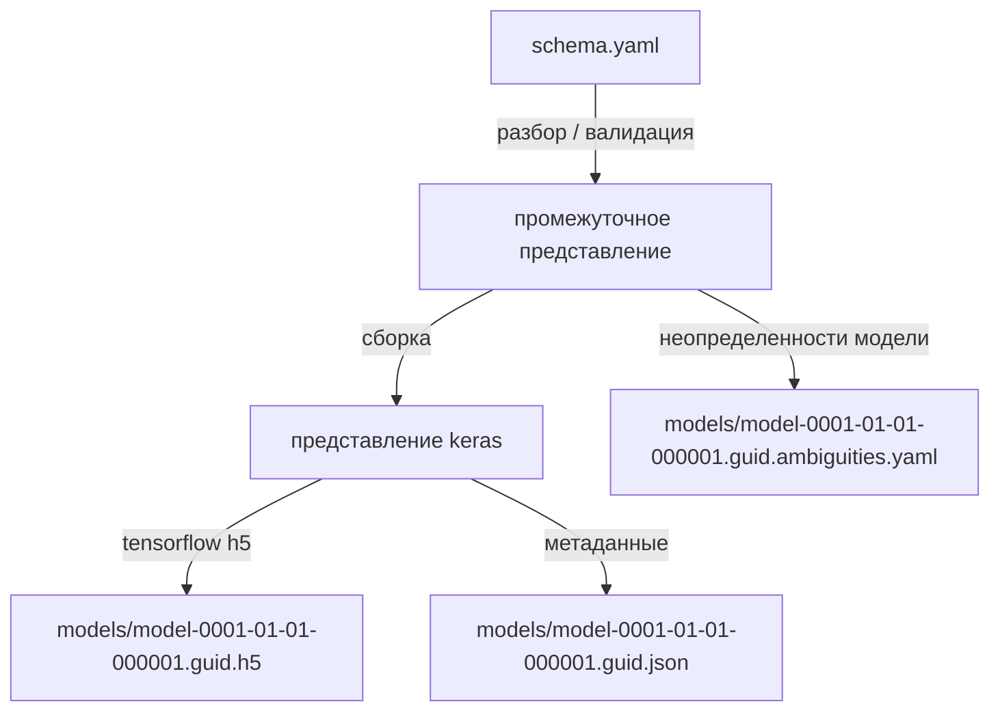

# Документация по Ngine CLI
## Команда `compile`

Выполняет синтаксический и семантический разбор модели, статический анализ, сборку и конвертацию модели в формат `.h5`, совместимый с `tensorflow/keras`, а также поиск неопределенностей модели с последующим сохранением их в файл для обработки командой `.\ngine.exe tune`




## Справка
___
> `.\ngine.exe compile -?`

```bash
Usage: Ngine.CommandLine compile [options] <FileName>

Arguments:
  FileName

Options:
  -p|--print      Print
  --compile-only  CompileOnly
  -?|-h|--help    Show help information
```

- Если указан, флаг `--compile-only` определяет, что конвертация модели в форматы `tensorflow/keras` не будет выполняться. В этом случае, будет выполняться только синтаксический и последующий семантический анализ с выводом на экран информации об ошибках компиляции.


- Флаг `-p|--print` определяет будет ли выведен на экран промежуточный результат синтаксического разбора схемы модели. Указание этого флага может быть полезным для отладки процессов разбора.

### Примеры:

```bash
$> .\Ngine.CommandLine.exe compile '..\samples\ngine-shema.yaml'

Parsing successful!
Start conversion using keras.NET...
Using TensorFlow backend.
Warning! onnxmltools is not installed
Warning! tensorflowjs is not installed
2020-05-02 01:13:25.025703: I tensorflow/core/platform/cpu_feature_guard.cc:142] Your CPU supports instructions that this TensorFlow binary was not compiled to use: AVX2
Model saved to file models\model-2020-05-02-011325.5c8b.h5
Ambiguities (3) saved to file models\model-2020-05-02-011325.5c8b.ambiguities.yaml
```

```bash 
$> cat 'models\model-2020-05-02-011325.5c8b.ambiguities.yaml'

ambiguities:
- value: '[3:5:1]'
  mappings:
  - name: 8-1
    prop: filters
- value: '[3,5,6]'
  mappings:
  - name: 5-1
    prop: kernel[0]
  - name: 5-1
    prop: kernel[1]
- value: '[84:100:2]'
  mappings:
  - name: 11-1
    prop: units
```