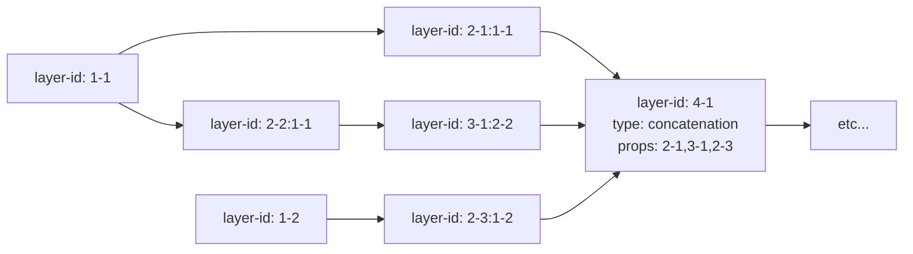

# Документация по типам языка `ngine-schema`

[[_TOC_]]

`ngine-schema` - это язык описания схем нейронных сетей, разработанный на основе языка `yaml`. 

Перед созданием собственных моделей `ngine-schema`, рекомендуется ознакомится с основами языка `yaml`, а также с [примером](../samples/network-definition.yaml)

Документ c описанием сети имеет формат `yaml` и содержит следующие поля:
- `layers` - список **входных и скрытых** слоев нейронной сети
- `heads` - список **выходных** слоев нейронной сети с назначенной функцией потерь
- `optimizer` - оптимизатор нейронной сети
- `ambiguities` (необязательно) - элемент описывающий области допустимых значений для каждого из неопределенных (переменных) гиперпараметров сети.

Ниже приводятся описания для каждого из полей документа `ngine-schema`.

# `ngine-schema.layers`

Поле `layers` представляет собой список элементов `layer`, каждый элемент имеет следующие поля:

- `layer-id` - идентификатор слоя, описывающий его положение в схеме
- `type` - тип слоя
- `props` - парметры слоя

## `layer.layer-id`
___

**Входные** слои имееют идентификаторы `'1-1'`, `'1-2'` и т.д. по порядку.

Для **скрытых** слоев указывается их собственный номер + `':'` + номер предшествуешего слоя.

Например, `'2-1:1-1'` описывет слой, находящийся на расстоянии `2` от входа в сеть и соединенный со `'1-1'`


___

## Как читать синтаксические шаблоны?

>>>
Шаблон синтаксического выражения, состовлящего данную документацию, представляет собой дерево, состоящее из пар `"тип: 'шаблон'"`.

`'шаблон'` может включать буквы, `(`круглые`)` и `[`квадратные`]` скобки, знаки препинания.

Подвыражения, заключенные в `( ... )*` могут встречаться 0, 1 или более раз подряд.

Подвыражения, заключенные в `( ... )?` являются опциональнымии.

Подвыражения, заключенные в `( ... | ... )` предоставляют выбор между шаблонами.

Подвыражение шаблона, имеющее вид `{{ x: uint }}`, определяют переменную с именем `x` и типом `unit`. Определение типа каждой переменной, входящей в выражение приводится на уровень ниже.
>>>

Ниже перечислены допустимые типы слоев с описаниями:

## `sensor1D` | `sensor2D` | `sensor3D`
___

Описывает **входные** слои искусственной нейронной сети.

### Синтаксиc:
```bash
-> sensor1D: '{{ inputs: uint }}'
   -> uint: 'positive integer'

-> sensor2D: '{{ channels: uint }}:{{ inputs: uint_vector2D }}'
   -> uint: 'positive integer'

   -> uint_vector2D: '[{{ x: uint }}x{{ y: uint }}]'
      -> uint: 'positive integer'

-> sensor3D: '{{ channels: uint }}:{{ inputs: uint_vector3D }}'
   -> uint: 'positive integer'

   -> uint_vector3D: '[{{ x: uint }}x{{ y: uint }}x{{ z: uint }}]'
      -> uint: 'positive integer'
```

### Параметры:

- `channels` - количество каналов многомерного входа (для `RGB` изображений значение равно `3`)
- `inputs` - размерность входа (для изображений `28x28` = `[28x28]`)

### Примеры:

Одномерный вход размера `100`:
```yaml
layer-id: '1-1'
type: sensor1D
props: 100
```

Двумерный вход:
```yaml
layer-id: '1-2'
type: sensor2D
props: '3:[28x28]'
```

Трехмерный вход: 
```yaml
layer-id: '1-1'
type: sensor3D
props: '2:[28x28x10]
```

## `dense`
___

Описывает одномерные полносвязные слои искусственной нейронной сети.

### Синтаксиc:

```bash
-> dense: '{{ units: %_uint }}'
   -> %_uint: '({{ value: uint }}|?({{ ref: word }}))'
      -> uint: 'positive integer'

      -> word: 'word without whitespace'
```

### Параметры:

- `units` ([настраиваемый](#ngine-schema.ambiguities)) - количество нейронов в слое.

### Примеры:
Полносвязный слой из `100` нейронов:
```yaml
layer-id: '2-1:1-1'
type: dense
props: 100
```

Полносвязный слой из [настраиваемого](#ngine-schema.ambiguities) числа нейронов:
```yaml
layer-id: '2-1:1-1'
type: dense
props: '?(units-1)'
```

## `conv2D` | `conv3D`
___

Описывает сверточные слои искусственной нейронной сети.

### Синтаксис:

```bash
-> conv2D: '{{ filters: %_uint }}:{{ kernel: %_uint_vector2D }}(, strides={{ strides: %_uint_vector2D }})?(, padding={{ padding: padding }})?'
   -> %_uint: '({{ value: uint }}|?({{ ref: word }}))'
      -> uint: 'positive integer'

      -> word: 'word without whitespace'

   -> %_uint_vector2D: '[{{ x: %_uint }}x{{ y: %_uint }}]'
      -> %_uint: '({{ value: uint }}|?({{ ref: word }}))'
         -> uint: 'positive integer'

         -> word: 'word without whitespace'

-> conv3D: '{{ filters: %_uint }}:{{ kernel: %_uint_vector3D }}(, strides={{ strides: %_uint_vector3D }})?(, padding={{ padding: padding }})?'
   -> %_uint: '({{ value: uint }}|?({{ ref: word }}))'
      -> uint: 'positive integer'

      -> word: 'word without whitespace'

   -> %_uint_vector3D: '[{{ x: %_uint }}x{{ y: %_uint }}x{{ z: %_uint }}]'
      -> %_uint: '({{ value: uint }}|?({{ ref: word }}))'
         -> uint: 'positive integer'

         -> word: 'word without whitespace'

   -> padding: '(same|zero)'
```

### Параметры:

- `filters` ([настраиваемый](#ngine-schema.ambiguities)) - количество выходных фильтров слоя
- `kernel` ([настраиваемый](#ngine-schema.ambiguities)) - размерность ядра свертки
- `strides` (опциональный) ([настраиваемый](#ngine-schema.ambiguities)) - размерность пространства шагов свертки. `[1x1]`, `[1x1x1]` по умолчанию
- `padding` (опциональный) - формат отступа:
  - `same` - отступ, при котором размерность выхода слоя совпадает с размерностью входа. Если вход слоя имеет размер `[28x28]`, `kernel=[5x5]`, а `strides=[1x1]`, то размер отступа будет установлен в `[2x2]`.
  - `zero` - нулевой отступ. Если вход слоя имеет размер `[28x28]`, `kernel=[5x5]`, а `strides=[1x1]`, то размерность выхода будет равна `[24x24]`.

### Примеры:

2D-свертка `[5x5]` с `3` выходными фильтрами, единичным шагом и отступом по умолчанию

```yaml
layer-id: '2-1:1-1'
type: conv2D
props: '3:[5x5]'
```

2D-свертка `[5x5]` с `3` выходными фильтрами, шагом `[2x2]` и нулевым отступом

```yaml
layer-id: '2-1:1-1'
type: conv2D
props: '3:[5x5], strides=[2x2], padding=zero'
```

3D-свертка `[5x5x5]` с `3` выходными фильтрами, шагом `[2x2x2]` и отступом по умолчанию

```yaml
layer-id: '2-1:1-1'
type: conv3D
props: '3:[5x5x5], strides=[2x2x2], padding=same'
```

2D-свертка ([настраиваемого](#ngine-schema.ambiguities)) размера с `3` выходными фильтрами, единичным шагом и отступом по умолчанию

```yaml
layer-id: '2-1:1-1'
type: conv2D
props: '3:[?(kernel-size-1)x?(kernel-size-1)]'
```

## `padding2D` | `padding3D`
___

Описывает пулинговые слои искусственной нейронной сети.

### Синтаксис:

```bash
-> pooling2D: '{{ pooling: pooling_type }}:{{ kernel: %_uint_vector2D }}(, strides={{ strides: %_uint_vector2D }})?'
   -> pooling_type: '(avg|max)'

   -> %_uint_vector2D: '[{{ x: %_uint }}x{{ y: %_uint }}]'
      -> %_uint: '({{ value: uint }}|?({{ ref: word }}))'
         -> uint: 'positive integer'

         -> word: 'word without whitespace'

-> pooling3D: '{{ pooling: pooling_type }}:{{ kernel: %_uint_vector3D }}(, strides={{ strides: %_uint_vector3D }})?'
   -> pooling_type: '(avg|max)'

   -> %_uint_vector3D: '[{{ x: %_uint }}x{{ y: %_uint }}x{{ z: %_uint }}]'
      -> %_uint: '({{ value: uint }}|?({{ ref: word }}))'
         -> uint: 'positive integer'

         -> word: 'word without whitespace'
```

### Параметры:

- `pooling` - функция пулинга, (`max` или `avg`)
- `kernel` ([настраиваемый](#ngine-schema.ambiguities)) - размерность ядра пулинга
- `strides` (опциональный) ([настраиваемый](#ngine-schema.ambiguities)) - размерность пространства шагов свертки. `[1x1]`, `[1x1x1]` по умолчанию.

### Примеры:

2D-пулинг с ядром `[5x5]`, функцией `max` и единичным шагом

```yaml
layer-id: '2-1:1-1'
type: pooling2D
props: 'max:[5x5]'
```

2D-пулинг с ядром `[5x5]`, функцией `avg` и шагом `[2x2]`

```yaml
layer-id: '2-1:1-1'
type: pooling2D
props: 'avg:[5x5], strides=[2x2]'
```


3D-пулинг с ядром `[3x3x3]`, функцией `avg` и шагом `[2x2x2]`

```yaml
layer-id: '2-1:1-1'
type: pooling3D
props: 'avg:[5x5x5], strides=[2x2x2]'
```

## `flatten2D` | `flatten3D`

Описывает слои изменения размерности для 2D-слоев или 3D-слоев до одномерного выхода. Поле `layer.props`  игнорируется, и может отстуствовать.

### Примеры:

```yaml
layer-id: '12-1:11-1'
type: flatten2D
```
```yaml
layer-id: '12-2:11-2'
type: flatten3D
```

## `concatenation`
___

Описывает слои-агрегаты, объединяющие один или несколько слоев одинаковой размерности в один.

### Синтаксиc:

```bash
-> concatenation: '{{ layers: layer_id array }}'
   -> layer_id array: '{{ first: layer_id }}(,{{ others: layer_id }})*'
      -> layer_id: '{{ row: uint }}-{{ col: uint }}'
         -> uint: 'positive integer'
```

### Параметры:

- `layers` - идентификаторы слоев, участвующих в объединении.

### Примеры:

Объединение слоев `2-1`, `3-1`, `2-3`:

```yaml
layer-id: '4-1:3-1'
type: concatenation
props: '2-1,3-1,2-3'
```

## `dropout`
___

Описывает слои исключения (дропаут), исключающие определенный процент связей сети из обучения.

### Синтаксиc:

```bash
-> dropout: '{{ rate: ufloat }}'
   -> ufloat: 'floating point number: (0; 1)'
```

### Параметры:

- `rate` - процент связей, исключенных из обучения.

### Примеры:

Объединение слоев `2-1`, `3-1`, `2-3`:

```yaml
layer-id: '4-1:3-1'
type: dropout
props: '0.09'
```


## `activation`
___

Описывает слои активации, применяющие определенную одномерную функцию к выходам предыдущего слоя, сохраняя ее размерность на выходе.

### Синтаксиc:

```bash
-> activation: '{{ activation: (relu|elu|leaky-relu|selu|tanh|sigmoid|hard-sigmoid) }}'
   -> relu: 'relu'

   -> elu: 'elu({{ alpha: ufloat }})'
      -> ufloat: 'floating point number: (0; 1)'

   -> leaky-relu: 'leaky-relu({{ alpha: ufloat }})'
      -> ufloat: 'floating point number: (0; 1)'

   -> selu: 'selu'

   -> tanh: 'tanh'

   -> sigmoid: 'sigmoid'

   -> hard-sigmoid: 'hard-sigmoid'
```

### Виды:

- `relu` - усеченное линейное преобразование
    ```math
    max(0, x)
    ```
- `leaky-role` - ReLU с "утечкой"
    ```math
    max(alpha*x, x)
    ```
- `elu` - экспоненциально-линейное преобразование
    ```math
    \begin{cases}
        x &\text{if } x \ge 0 \\
        alpha * (e^x - 1) &\text{if } x < 0
    \end{cases}
    ```
- `selu` - саморегулирующийся `elu`
- `tanh` - гиперболический тангенс
- `sigmoid` - сигмоида
    ```math
    1/(1+e^-x)
    ```
- `hard-sigmoid` - сигмоида
    ```math
    \begin{cases}
        0 &\text{if } x < -2.5 \\
        1 &\text{if } x > 2.5 \\
        0.2*x + 0.5 &\text{if } x \le x \ge 2.5
    \end{cases}
    ```

### Примеры:

```yaml
layer-id: '4-1:3-1'
type: activation1D
props: 'relu'
```

```yaml
layer-id: '4-1:3-1'
type: activation2D
props: 'elu(0.01)'
```

# `ngine-schema.heads`

Поле `heads` представляет собой список элементов `head`, каждый элемент имеет следующие поля:

- `layer-id` - ссылка на идентификатор предыдущего слоя
- `activation` - функция выходных значений. Поддерживает все [одномерные функции](#activation), а также `softmax`
- `loss` - функция потерь
- `loss-weight` - число от 0 до 1. Размер вклада, который оказывает данный выход на обучение всей сети

## `head.loss`
___
Функция потерь может примать одно из следующих значений:

- `ce` - категориальная кросс-энтропия
- `bce` - двоичная кросс-энтропия
- `mse` - среднеквадратическая ошибка

___

### Примеры:

```yaml
layer-id: '13-1'
activation: softmax
loss: ce
loss-weight: 1
```


# `ngine-schema.optimizer`

Поле `optimizer` определяет используемый при обучении оптимизатор сети.

### Синтаксис:

```bash
-> sgd: 'sgd({{ learningRate: ufloat }})(, momentum={{ momentum: ufloat }})?(, decay={{ decay: ufloat }})?'
   -> ufloat: 'floating point number: (0; 1)'

-> rmsProp: 'rmsProp({{ learningRate: ufloat }}), rho={{ rho: ufloat }}(, decay={{ decay: ufloat }})?'
   -> ufloat: 'floating point number: (0; 1)'

-> adam: 'adam({{ learningRate: ufloat }}, {{ beta1: ufloat }}, {{ beta2: ufloat }})(, decay={{ decay: ufloat }})?'
   -> ufloat: 'floating point number: (0; 1)'
```

### Виды:

- `sgd` - стохастический градиентный спуск
  - `learningRate` - скорость обучения. Рекомендуется использовать значения порядка 0.001
  - `momentum` (необязательно) - параметр, который ускоряет SGD в соответствующем направлении и гасит колебания
  - `decay` (необязательно) - коэффициент затухания

- `rmsProp` - RMSProp
    - `learningRate` - скорость обучения. Рекомендуется использовать значения порядка 0.001
    - `rho` - рекомендуемое значение = 0.9
    - `decay` (необязательно) - коэффициент затухания
  
- `adam` - Метод адаптивной оценки моментов Adam
   - `learningRate` - скорость обучения. Рекомендуется использовать значения порядка 0.001
    - `beta1` - рекомендуемое значение = 0.9
    - `beta2` - рекомендуемое значение = 0.999
    - `decay` (необязательно) - коэффициент затухания


### Примеры:

- `sgd(0.001), momentum=0.1`
- `adam(0.001), 0.9, 0.999, decay=0.1`
___

# `ngine-schema.ambiguities`

Язык `ngine-shcema` пеоддерживает возможность оставлять некоторые из гиперпараметров сети неопределенными до момента автоматической настройки. 

Синтаксически это выражается в том, что на месте значений некоторых гиперпараметров в различных шаблоных нейросети указываются ссылки на переменные "**неопределенностей**" (``ambiguities``).

Например, вот так выглядит "полносвязный" слой из 100 нейронов на схеме:

```yaml
layer-id: '2-1:1-1'
type: dense
props: 100
```

А вот так, слой с неопределенным числом нейронов (`some-variable-name` - имя переменной)

```yaml
layer-id: '2-1:1-1'
type: dense
props: $(some-variable-name)
```

Имя переменной "**неопределенности**" может содержать цифры, строчные буквы английского алфавита, символы-разделители `'_'` или `'-'`

Каждая из переменных, на которую в схеме присутствует ссылка, должна быть определена в блоке `ngine-schema.ambiguities`.

Определение переменной "**неопределенности**" имеет следующие поля:
- `name` - имя переменной (например, `some-variable-name`)
- `value` - область допустимых значений перемненой (промежуток или список)

### Синтаксис:
```bash
-> uint array|uint range: '[({{ list: uint array }}|{{ range: uint range }})]'
   -> uint array: '{{ first: uint }}(,{{ others: uint }})*'
      -> uint: 'positive integer'

   -> uint range: '{{ from: uint }}:{{ end: uint }}:{{ step: uint }}'
      -> uint: 'positive integer'
```
- Список `uint array` представляет собой множество из одного или более целых чисел, разделенных запятой.
    
    Например, `[1,2,5,4,8]`

- Промежуток `uint range` представляет собой описание структуры, имеющей начало `from`, конец `end` и шаг `step`.
    
    Например, `[1:7:2]` (эквивалентно `[1,3,5,7]`)

Все списки и промежутки являются целочисленными. Настройка строковых, а также вещественных параметров временно не поддерживается.

### Примеры:

```yaml
name: `some-variable-name`
value: '[3:5:1]'
```
```yaml
name: `some-variable-name`
value: '[1,2,5,3,6]'
```
